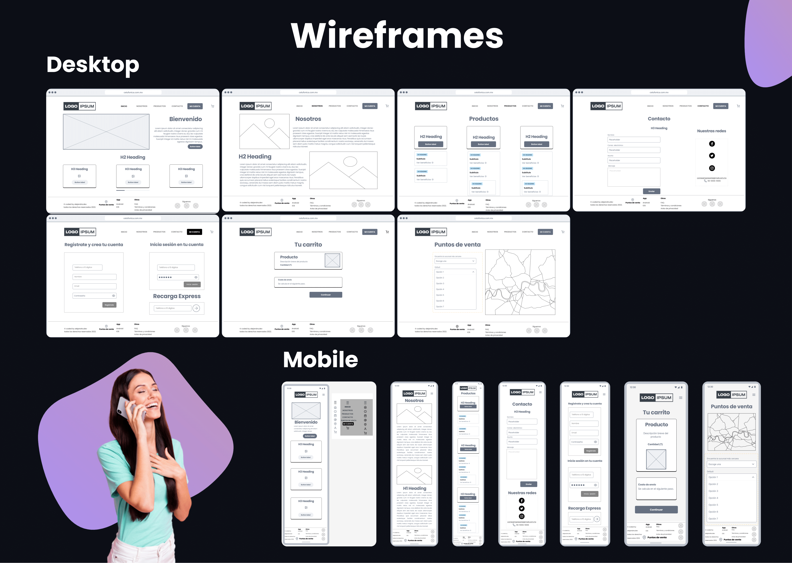

# Celufónica 
[Código](https://github.com/AlePedrero/celufonicamx "Código")
[Sitio Web](https://alepedrero.github.io/celufonicamx/ "Sitio Web")

Proyecto desarrollado y creado para **Celufónica**, una start up ficticia de telecomunicaciones.

## Tecnologías utilizadas
+ HTML
+ CSS
+ Bootstrap
+ SASS

