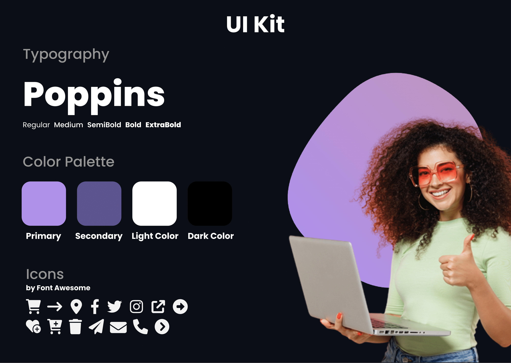

# Celufónica 
-
[Código](https://github.com/AlePedrero/celufonicamx "Código")
-
[GitHub Pages](https://alepedrero.github.io/celufonicamx/ "GitHub Pages")
-
[000webhost](https://celufonica.000webhostapp.com/ "000Webhost")
-
[Vercel](https://celufonicamx.vercel.app/ "Vercel")

Proyecto desarrollado y creado para **Celufónica**, una start up ficticia de telecomunicaciones.

## Tecnologías utilizadas
+ HTML
+ CSS
+ Bootstrap
+ SASS

